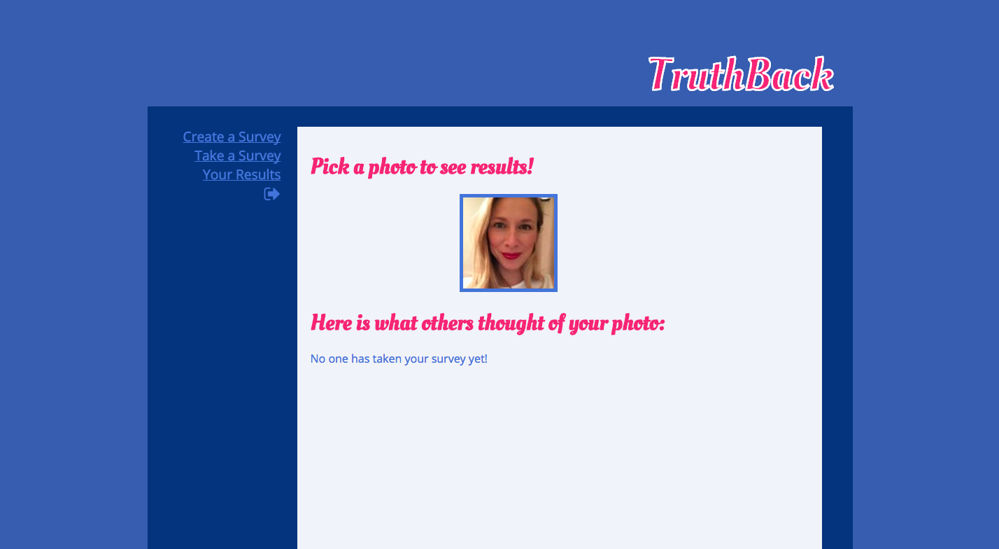

# TruthBack

## Summary

Truthback was built to help you bridge the gap between what you think your dating profile picture is saying about you and what is actually being conveyed to potential matches.  Upload your photo via Facebook and choose a word that describes the look you're going for. Your photo becomes a poll for other TruthBack users- giving you instant feedback on your photos!  
	 
## Technologies
* Sinatra
* Omniauth for Facebook
* Ruby & Javascript
* Ajax
	
## API's
* Facebook OAuth

## User Experience

## Strech Goals
* A user can sign up without a Facebook account
* A non-facebook user can upload a photo
* Create a data visualization for user's surveys' results